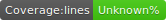
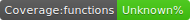
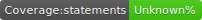

[](https://travis-ci.com/frappacchio/form-serialize)
# Index

- [Installation](#installation)
- [Usage](#usage)
- [License](#license)

# Installation

**yarn**

```sh
yarn add form-serialize-all
```

**npm**

```sh
npm install --save form-serialize-all
```

# Usage

```html
<form action="" class="example-form">
  <input type="text" value="My awesome name" name="name" />
  <input type="text" value="My awesome surname" name="surname" />
  <input type="checkbox" value="I am the most modest person in the world" name="modest" checked="" />
</form>
```

```js
import SerializeForm from 'form-serialize-all';

const myFormElement = document.querySelector('.example-form');
const seralize = new SerializeForm(myFormElement);

console.log(seralize.getData('array')); // [{name:'My awesome name'}, {surname:'My awesome surname'}, {modest:'I am the most modest person in the world'}]
console.log(seralize.getData('object')); //{name:'My awesome name', surname:'My awesome surname', modest:'I am the most modest person in the world'}
console.log(seralize.getData()); // 'name=My awesome name&surname=My awesome surname&modest=I am the most modest person in the world'
```

# License

[Apache License](/LICENSE.md)
